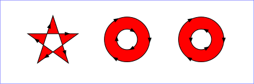

# 关于SVG的`fill-rule`以及TTF的字符轮廓方向(glyph contour direction)

由于Sketch在设计界的流行，支持导入Sketch生成的SVG文件是`fount`的一个目标。但是Sketch导出的
SVG文件烂是公认的事实，由于TTF文件并不能100%支持SVG的特性，所以转换的时候有些东西其实是会被丢掉的。
我们要做的是尽可能保留SVG文件对字符形状的描述，至于颜色之类的根本不重要。

这个事情要从Sketch生成的SVG文件中的一个attribute说起, `fill-rule`。这个attribute在SVG中有
两个值（实际是三个，但是`inherit`对我们来说没有实际意义），`nonzero`(默认)和`evenodd`。最新
版本(40.x)的Sketch生成的SVG文件的`fill-rule`似乎永远都是`evenodd`，但是TTF的填充算法只支持
`nonzero`，这两种模式的效果在同一个图像中有时候是不一样的。

## SVG路径

SVG支持的基础图形包括，矩形(`<rect>`)、圆(`<circle>`)、椭圆(`<ellipse>`)以及多边形(`<polygon>`)
等等，这些基础图形又都可以归结到路径（`<path>`)来，它们只是一种‘语法糖’。

## `fill-rule`是干什么的？

简单来说，这个属性定义了使用什么算法来判断一个点在路径里面还是外面。对于不相交的路径一个点在里面还是
外面是很直观的，但是对于有重叠的复杂路径，就需要一些规则来确定点在里面还是外面，`full-rule`就是
定义这个算法的。

## `evenodd`

这个规则比较简单：从点往任意方向画一条射线，如果这条射线和路径的交点个数是偶数则认为点在路径外；
如果交点个数是奇数则认为点在路径内。

## `nonzero`

这个规则的定义是这样的：从点往任意方向画一条射线，我们维护一个计数，从零开始，如果路径中的某段
从左向右和射线相交，计数加一；如果路径中的某段从右向左和射线相交，计数减一。最终，如果计数为零则
点在路径外；如果计数不为零则点在路径内。

## `fill-rule`对生成字体的影响

从上面的规则描述中我们知道，`evenodd`判断点在路径内／外与路径的方向是无关的，而`nonzero`是和
路径方向有关系的，正是这个区别会导致有些SVG生成的字符会出现填充错误的情况。

## 解决方案

在Sketch中画图的时候据我所知是不显示路径方向的，我们假设所有路径都是顺时针方向，那么一些复杂图形
在两种`fill-rule`下会显示成不同的样子。如果想让图片在两种模式下显示一样，Sketch中有一个操作可以
做到，但是比较麻烦，选择不正常的路径在菜单`Layer -> Paths -> Reverse Order`一般可以解决问题。
这种方式需要人工干预，尤其是在Sketch下无法看到路径方向的情况下操作很不方便。

`fount`的`correct_contour_direction`参数可以控制是否自动修复这些有问题的路径。这个功能需要
安装`fontforge`，而且有个别情况下这个功能可能无法自动修复这些问题。
